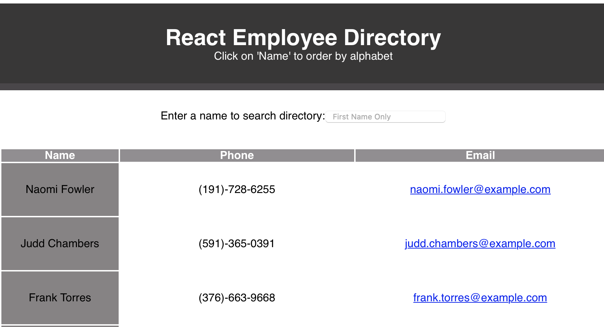

<h1 align="center">React Employee Directory</h1>



Click to [deploy](https://eduardo-react-employee-dir.herokuapp.com).
  
<br />
## Description
🔍 Utilizing react to create a interactive employee directory that updates dynamically, based on searches or ordering by name. Imports API from an open source to retrieve information to create employees
## Table of Contents
- [Description](#description)
- [License](#license)
- [Installation](#Installation)
- [Contributing](#contributing)
- [Tests](#Tests)
## Installation

```
npm install
```

## Usage

```
npm start
```

## Tests

## License

<br />
This application is covered by the MIT license. 
## Contributing
Eddie Ibarra
<br />
:octocat: Find me on GitHub: [ibarrasb](https://github.com/ibarrasb)<br />
<br />
✉Email me with any questions: eddieibarra43@gmail.com<br /><br />

    